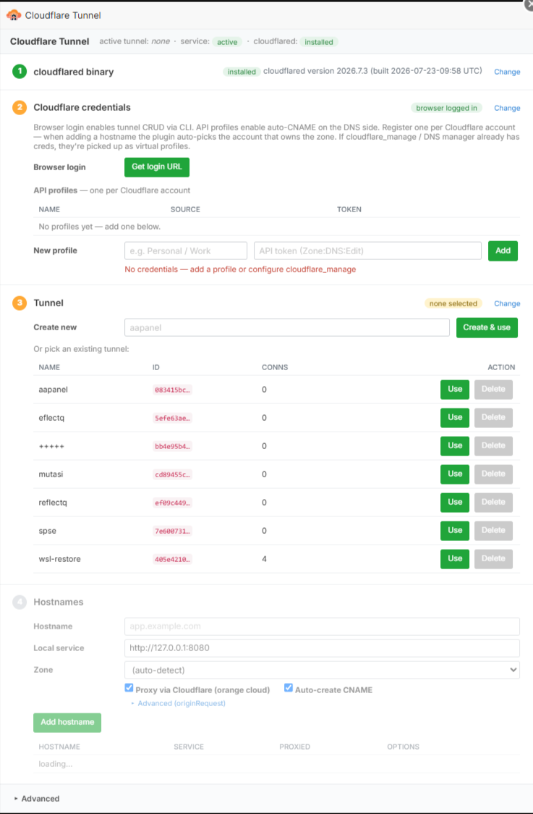

# Cloudflare Tunnel for AAPanel

Expose any AAPanel site through a Cloudflare Tunnel (cloudflared) — without opening a port, owning a public IP, or touching nginx vhosts. All ingress mapping, DNS, and the systemd service are managed from the panel UI.

<p align="center">
  
</p>

## Features

- One-click install/update of the `cloudflared` binary
- Browser login (`cloudflared tunnel login`) **and** API-token auth (verified before save)
- **Multi-account support** (v1.2.0) — register multiple Cloudflare accounts as *profiles*, plugin auto-picks the right one by matching the hostname to zones across all accounts
- Tunnel CRUD via the cloudflared CLI (create / list / select / delete)
- Hostname → local service ingress rules (`http://127.0.0.1:8080`, `tcp://…`, `http_status:404`, `hello_world`)
- **Per-hostname `originRequest`** overrides (v1.1.0) — `noTLSVerify`, `httpHostHeader`, `originServerName` (SNI), `connectTimeout`, `tlsTimeout`, `http2Origin`, `disableChunkedEncoding` — all from the UI, no manual `config.yml` editing
- Auto-creates / upserts the public CNAME on Cloudflare (`<sub>.zone → <tunnel-id>.cfargotunnel.com`, proxied)
- Reuses the **existing Cloudflare credentials** stored by AAPanel's `cloudflare_manage` plugin / DNS manager — surfaced as read-only *virtual profiles*, no need to re-enter your token
- Atomic add: if DNS or config-apply fails, the ingress row is rolled back
- Materializes a real `credentials-file` from a tunnel token, so `cloudflared service install` works on tunnels created before the plugin existed (or via the Zero Trust dashboard)
- systemd lifecycle controls: install / start / stop / restart / uninstall
- Live `journalctl` view in the Advanced panel

## Install

### From the plugin archive (recommended)

1. Download the latest release: **[`cloudflare_tunnel-1.2.0.zip`](https://github.com/fdciabdul/Cloudflare-Tunnel-aaPanel/releases/latest)**.
2. AAPanel → **App Store** → top-right **Import** (upload icon) → pick the zip.
3. Open the plugin → follow the **4-step wizard** (binary → auth → tunnel → hostnames).

### From source (dev / symlink)

```bash
git clone https://github.com/fdciabdul/Cloudflare-Tunnel-aaPanel.git
cd Cloudflare-Tunnel-aaPanel
./install_to_aapanel.sh link    # symlink — edits go live without re-packaging
# or
./install_to_aapanel.sh         # copy
```

The script symlinks/copies `cloudflare_tunnel/` into `/www/server/panel/plugin/cloudflare_tunnel/`. Bounce the panel (`bt restart`) after first install or if you change Python files.

## Quick start (4-step wizard)

1. **cloudflared binary** → *Install / Update*
2. **Cloudflare credentials** → click *Get login URL* (browser) **and/or** add API-token profiles (one per Cloudflare account)
3. **Tunnel** → create a new tunnel (e.g. `aapanel`) → *Use*
4. **Hostnames** → add `app.example.com → http://127.0.0.1:8080` — plugin resolves the zone, picks the right profile, upserts the CNAME, writes `config.yml`, and restarts the service in one shot

Steps auto-collapse once satisfied — click *Change* on any of them to reopen. Service controls and live logs live under **▸ Advanced** at the bottom.

## Multi-account

Register multiple profiles in the Auth step (e.g. `Personal`, `Work`, `Client-X`). When you add a hostname the plugin:

1. Scans zones across **all** profiles (60s cache)
2. Longest zone-suffix match wins → identifies the owning profile
3. Uses that profile's token for the CNAME upsert automatically

Zone dropdown in the Add-hostname form is grouped by account so you can see who owns what at a glance:

```
▾ Zone
   ── Personal ──
      example.com
      app.dev
   ── Work ──
      corp.io
      internal.corp.io
```

## Architecture

```
cloudflare_tunnel/
├── info.json                  panel metadata
├── install.sh                 AAPanel install/uninstall hook
├── icon.png                   plugin tile icon
├── cloudflare_tunnel_main.py  dispatcher for /plugin?action=a&name=cloudflare_tunnel&s=…
├── tunnel_manager.py          cloudflared binary, login, tunnel CRUD, systemd
├── dns_manager.py             profile storage, credential discovery, Cloudflare API
├── ingress_manager.py         hostname↔service rules + originRequest, config.yml writer
├── index.html                 4-step linear-wizard UI
└── data/                      runtime: state.json, ingress.json, api_profiles.json (gitignored)
```

### Credential precedence

The plugin considers profiles in this order (all can coexist):

1. Plugin-local profiles from `data/api_profiles.json` (added via Auth step, one per Cloudflare account)
2. Virtual profile from `cloudflare_manage` plugin's `cf_default.json`
3. Virtual profile from AAPanel DNS manager (`config/dns_mager.conf`, each `CloudFlareDns` entry)

Virtual profiles are read-only in the UI (managed by their owning plugin) but participate in zone matching just like local ones.

### Remote-managed tunnels

If you select a tunnel that was configured in the Cloudflare Zero Trust dashboard, cloudflared will ignore the local `config.yml` and pull ingress from the dashboard. Either switch it to locally-managed in the dashboard, or create a fresh tunnel through this plugin.

## Build the archive yourself

```bash
cd cloudflare_tunnel
zip -r ../dist/cloudflare_tunnel-$(jq -r .versions info.json).zip . \
    -x "data/*" "__pycache__/*" "*.pyc"
```

## License

MIT
